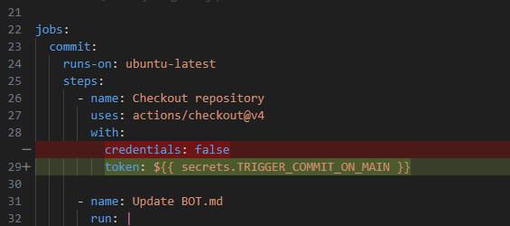

## main에 커밋되었을 때 트리거되는 워크플로우 탐색

`repository_dispatch`로 메인에 커밋을 남기는 `commit.yaml`을 트리거해도 `after-commit-on-main-pat-token.yaml`이 트리거되지 않는다. 
권한 문제인가 싶어 `commit.yaml`의 push 워크플로우에서 기존에 사용하던 기본 GITHUB_TOKEN 말고 권한을 가진 PAT_TOKEN도 사용해 봤지만 메인 커밋 후 트리거되어야 할 다른 워크플로우가 트리거되지 않았다.

### 가능한 것들
- push 워크플로우가 아니라 그 앞인 `commit.yaml`의 Checkout 단계에서 `token`을 PAT Token으로 명시해주면 이 워크플로우가 `after-commit-on-main-pat-token.yaml`를 트리거할 수 있게된다.
- [정보](https://stackoverflow.com/questions/64076798/how-can-i-trigger-a-github-actions-workflow-on-push-to-another-branch)

- main에 push가 아니라 특정 워크플로우를 listening 하는 워크플로우인 `after-commit-on-main-wrofklow-run.yaml`은 `commit.yaml`이 종료되었을 때 정상적으로 트리거되었다.

## 이외 잡다한 거
if: ${{ failure() }} 는 포함된 잡 안에서 앞에 있는 어떤 step이라도 실패하면 [실행된다](https://github.com/khkim6040-su/playground/actions/runs/16766667306/job/47473001289).  
다른 잡에서 실패한 step은 [잡지 않음](https://github.com/khkim6040-su/playground/actions/runs/16766743786)

